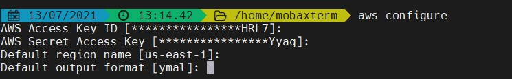

# aws-serverless-app
Basic serverless application in nodejs and DynamoDB

## Basic system steup
First we need to install aws-cli, currently v2 is latest
https://docs.aws.amazon.com/cli/latest/userguide/install-cliv2.html

### Setup aws-cli in terminal
```
$ aws configure
```
it will ask some more details as below


use YMAL as default output format


Need to install npm serverless package globally, or can be used as npx
more documentation navigate to [Serverless Documentation](https://www.serverless.com/framework/docs/getting-started/)
```
$ npm i serverless -g
```
### Basic setup vscode ide
Install following VScode pluins for better developer experience
  1. Serverless IDE
  2. YAML

## What's included
* Folder structure used consistently across our projects.
* [serverless-pseudo-parameters plugin](https://www.npmjs.com/package/serverless-pseudo-parameters): Allows you to take advantage of CloudFormation Pseudo Parameters.
* [serverless-bundle plugin](https://www.npmjs.com/package/serverless-pseudo-parameters): Bundler based on the serverless-webpack plugin - requires zero configuration and fully compatible with ES6/ES7 features.

## Getting started
```
$git clone https://github.com/koushik0004/aws-serverless-app.git
cd aws-serverless-app
npm install
```